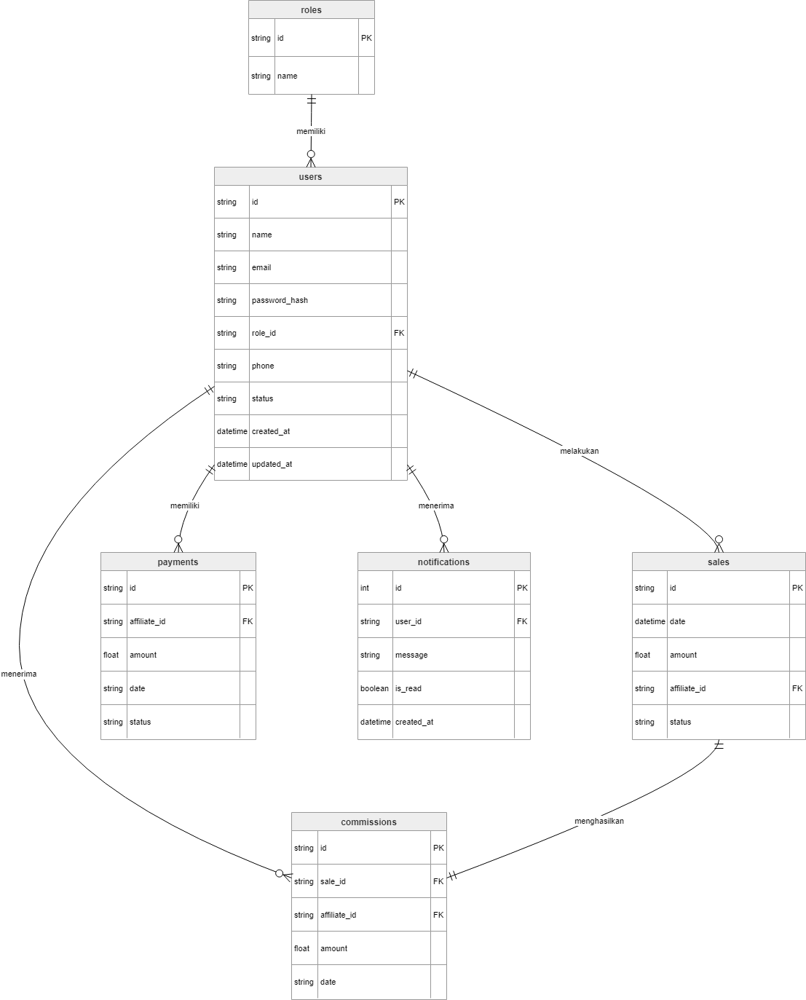

# LoopAffi - SISTEM INFORMASI KOMISI AFFILIATE

## Overview

**LoopAffi** adalah aplikasi berbasis web yang dirancang untuk mengotomatisasi pengelolaan komisi affiliate secara terpusat, efisien, dan transparan. Sistem ini dikembangkan untuk menggantikan proses manual yang rentan terhadap kesalahan dalam pencatatan penjualan, perhitungan komisi, serta pemantauan status pembayaran.

Melalui platform ini, admin dapat mengelola data penjualan, menghitung komisi otomatis, dan memantau proses pembayaran dalam satu sistem yang terintegrasi. Di sisi lain, affiliate dapat melihat performa penjualan dan jumlah komisi yang diperoleh secara real-time melalui dashboard yang informatif dan mudah digunakan.

Tujuan utama dari pengembangan sistem ini adalah meningkatkan efisiensi operasional, meminimalkan *human error*, serta memperkuat transparansi antara admin dan affiliate dalam proses pengelolaan komisi.

---

## Fitur Utama

- Manajemen data affiliate
- Input dan pencatatan data penjualan
- Perhitungan komisi otomatis
- Monitoring status pembayaran komisi
- Dashboard performa affiliate
- Rekap penjualan dan komisi secara terpusat
- Transparansi data antara admin dan affiliate

---

## 📊 Perancangan Sistem (DFD)

### DFD Level 0


*Diagram Konteks yang menunjukkan aliran data global.*

### DFD Level 1


### ERD



---

## 🎨 Mockup Antarmuka

Rancangan UI aplikasi yang berfokus pada pengalaman pengguna.

| Login Page | Dashboard | Core Feature |
| :---: | :---: | :---: |
| <br>**Login & Register** | <br>**Dashboard Admin** | <br>**Manajemen Sales (Admin)** |
| - | <br>**Dashboard User** | <br>**Data Sales (User)** |
| - | - | <br>**Komisi** |
| - | - | <br>**Pembayaran (Admin)** |
| - | - | <br>**Pembayaran (User)** |
| - | - | <br>**Report / Laporan** |

---

## Tech Stack

- **Frontend**: Reactjs
- **Backend**: GoLang
- **Database**: PostgreSQL

---

## Instalasi

```bash
# 1. Clone repository
git clone [https://github.com/username/loopAffi.git](https://github.com/username/loopAffi.git)

# 2. Install dependencies
npm install

# 3. Jalankan server
npm run dev
